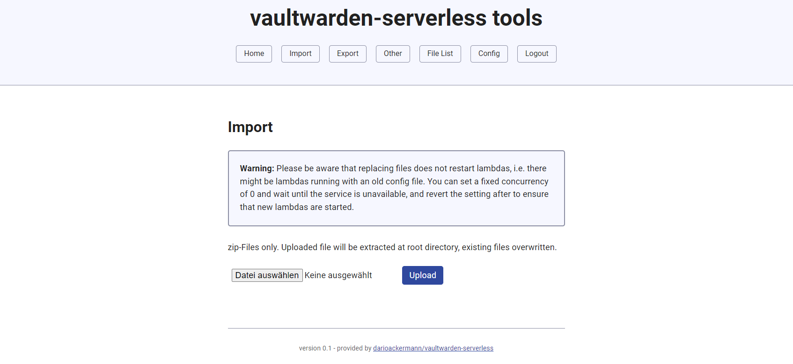

Welcome to vaultwarden-serverless, providing you with the power to host your favorite password manager on serverless AWS infrastructure, at almost no cost!

## ⚠️ Warning - WIP ⚠️
Todo to get a first version that can be released to the public
- [ ] Fix MySQL Linking
- [ ] Verify sqlite corruption issues

## AWS Bootstrap File

### From releases 📁
You can download the prebuilt, ready-to-deploy zip file from releases.

### Build it yourself 💻
 
To build the bootstrap file yourself, you need `docker`.   
Also, around 6GB of RAM is recommended to be able to build succesfully.

```sh
# Go to build directory
cd build
# Clone vaultwarden
git clone -b add-serverless-support https://github.com/darioackermann/vaultwarden-serverless.git
# Build lambda-builder
docker build . -t lambda-builder
# Build lambda-bootstrap binary
docker run --rm --mount type=bind,source="./vaultwarden-serverless/",target=/build lambda-builder
```

You will find a `bootstrap.zip` in your build folder that you can now deploy using terraform.

## Tools 🛠️
Included in this repo is "vaultwarden-serverless-tools", a little toolset that allows you to import and export the db and other data with ease. Also, it allows other small changes


## Deployment (with Terraform) ☁️

A toy example involving a complete setup with terraform is provided in `examples/`.
Deploy it using `terraform init`, `terraform apply`

### Config values

```
vaultwarden_admin_hash = "VALID ARGON2 HASH"
gateway_domain         = "vaultwarden.yourserver.com"
aws_region             = "eu-central-1"
```

### Notes

**Note 1:** **To save 99% costs**, this deployment violates AWS best practises as it does neither use a NAT-Gateway nor an ALB/ELB. We assign an elastic IP to the lambda
network interface which allows us to reach the internet regardless of a missing gateway.

**Note 2:** During deployment, Terraform will wait to verify DNS entries for the Certificate.
Please look up the needed values in your console and set them accordingly.

**Note 3:** If you want to import old config, sqlite databases, DO NOT browse the vault after deployment but rather go to the tools page to import your old config - otherwise you will already spin up a lambda with newly generated config files (which you then need to wait for to go down again). After importing old private/public keys, you might need to authenticate again on the tools website (if you hit a new lambda with your restored config)

### Deployed functionality

* Small VPC with one public subnet, a route-table and an internet gateway
* API Gateway including Certificates (**setting of DNS entries for certificate verification manually required**)
* EFS with backup (default settings) enabled
* Lambda functions


Your setup will be reachable on the following domains:
* Vault: https://vaultwarden.yourserver.com
* vaultwarden-admin: https://vaultwarden.yourserver.com/admin 
* vaultwarden-serverless-tools: https://vaultwarden.yourserver.com/tools/ (<- note the trailing slash)

## Contributing 🐱‍👤

Your contribution is gladly appreciated. Please feel free to open issues and pull requests, and I'll have a look at them as soon as possible. To easen my work, please provide as much information as possible (for bugs) and as much description as possible (for pull requests)

##  Sponsoring ❤️

I'm a student maintaining this project in my freetime. If it helps you keeping your monthly costs down, I'd appreciate a one-time tip or monthly support to keep my free work going. Thanks a lot ❤️